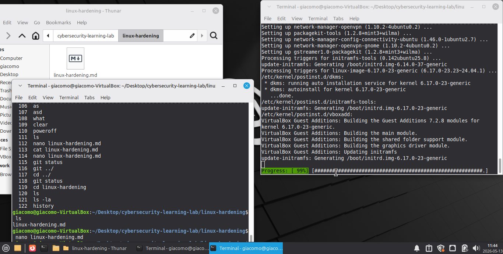

#im only using linux basic commands for this project

##things that I've learned:
- update and upgrade the system to keep it secure
- install and enable firewall, and check it's status
- install fail2ban and check it's status (don't have good knowledge for this, but all I know is that it prevents repeated login guess password, it temporary bans the ip of the attacker)
- checking the current user to see if there is another user
- install net-tools and check open ports

##all command prompts i've learned:
- cd - change or navigate directory
- rm - remove
- nano - edit file
- mv - move file or rename file
- mkdir - create folder
- touch - create a specific file
- ls - list all files 
- cp - copy file
- cat - show file content
- whoami - check who is the current user
ping - test connection in a web
sudo - i think its a linux command itself
sudo apt [action] - for installing package
sudo [package-name] [command] - i think for what action will do based on what package installed
chmod 600 [filename] - only the owner can read and write the specific file
sudo netstat -tulnp - displaying all ports i think

